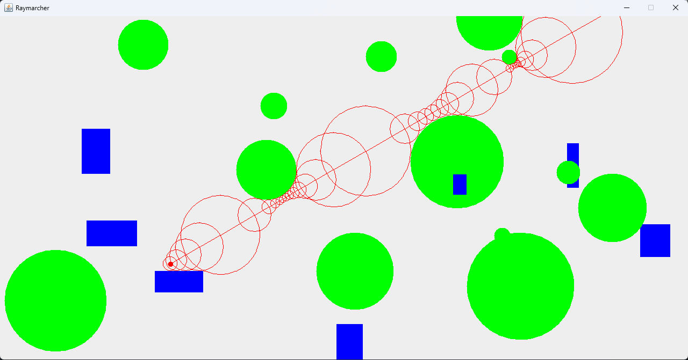

# RayMarching

This program simulates a technique used in computer graphics, particularly in the context of rendering images, to generate realistic and complex scenes. It's especially powerful in real-time computer graphics and interactive applications. Unlike traditional rasterization techniques involving triangles and pixels, raymarching traces rays through a scene, iteratively marching along those rays to find intersection points with surfaces in a 3D environment.

Learn more about it here:
- [Michael Walczyk's Blog](https://michaelwalczyk.com/blog-ray-marching.html) 🎨
- [Adrian Biagioli's Article](https://adrianb.io/2016/10/01/raymarching.html) 🌐
- [Typhoon's Teaching Material](https://typhomnt.github.io/teaching/ray_tracing/raymarching_intro/) 📚

## Table of Contents

- [Overview](#overview)
- [Prerequisites](#prerequisites)
  - [Getting Started](#getting-started)
- [Enjoy](#enjoy)

## Overview 🚀

This program is written using Java and the JavaSwing library—nothing fancy. Use your mouse pad or any device that allows the cursor to move to navigate and manipulate the camera. Right/Left-click to change the perspective direction.

## Prerequisites 🛠️
- First, you'll need to have [**JRE**](https://www.guru99.com/how-to-open-a-jar-file.html#:~:text=You%20need%20a%20Java%20Runtime,and%20it%20will%20start%20running.) to run the [**jar**](https://docs.oracle.com/javase/8/docs/technotes/guides/jar/jarGuide.html) file for this program.
- If you already have **JRE** installed, proceed to [Getting Started](#getting-started).

**Check for JRE on your system:**
- For _macOS and Linux_:
  - Open a terminal window. Type in
    ```
     java -version
    ```
- For _Windows_:
  - Open Command Prompt. Type in
    ```
     java -version
    ```

### Getting Started 🚀
- **Option 1**
  - Navigate to the **_release_** section in the [**repository**](https://github.com/JackHuynh0610/RayMarching). Click on **RayMarching alpha**.
  - Download the **.jar** file. Remember where you installed it, navigate to that folder, double-click on it, and then enjoy!
- **Option 2**
  - Clone this repository, navigate to the jar file, and then run it. By cloning, you can explore the source code and test things out on your machine.

### Troubleshoot 🛠️
- If you have **JRE** installed but the program still won't run
  - Check the Environment Path. This [**link**](https://www.javatpoint.com/how-to-set-path-in-java) might be helpful.

## Enjoy 🌟
 🚀
